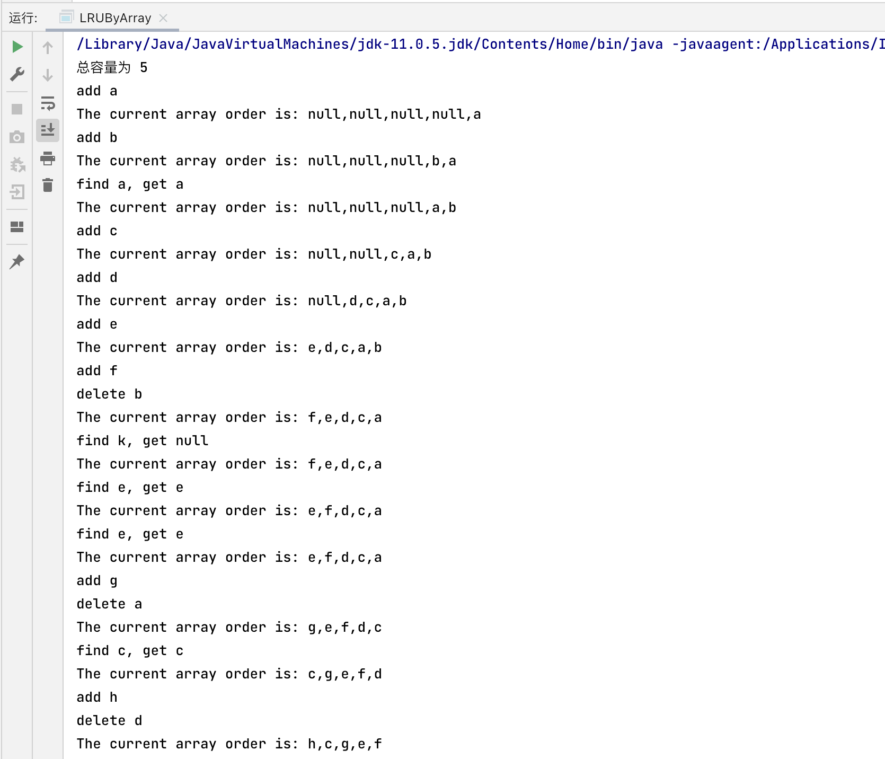

## 简介
LRU：最近最少使用，常见于缓存策略
## 数组实现
```java
public class LRUByArray {

    final static String[] arr = new String[5];
    final static int capacity = 5;
    static int count = 0;

    static {
        System.out.println("总容量为 5");
    }

    public static void main(String[] args) {
        System.out.println("add a");
        add("a");
        printArr();
        System.out.println("add b");
        add("b");
        printArr();
        System.out.println("find a, get " + findStr("a"));
        printArr();
        System.out.println("add c");
        add("c");
        printArr();
        System.out.println("add d");
        add("d");
        printArr();
        System.out.println("add e");
        add("e");
        printArr();
        System.out.println("add f");
        add("f");
        printArr();
        System.out.println("find k, get " + findStr("k"));
        printArr();
        System.out.println("find e, get "+ findStr("e"));
        printArr();
        System.out.println("find e, get "+ findStr("e"));
        printArr();
        System.out.println("add g");
        add("g");
        printArr();
        System.out.println("find c, get " + findStr("c"));
        printArr();
        System.out.println("add h");
        add("h");
        printArr();
    }

    // 从头部开始查找，越靠近头部，就越是最近访问过的元素
    // 如果查找到的元素不位于头部，就将该元素搬移到头部
    public static String findStr(String s) {

        int headIndex = capacity - count;
        int curIndex = -1;

        for (int i = headIndex; i < capacity; i++) {
            if (s.equals(arr[i])) {
                curIndex = i;
                break;
            }
        }

        if (curIndex == -1) return null;

        if (curIndex != headIndex) {
            String temp = arr[curIndex];
            someElementForwardOneStep(curIndex, headIndex);
            arr[headIndex] = temp;
        }

        return s;
    }

    // 默认添加的数不重复
    // 从尾部向前添加，这样最新的元素始终位于数组头部
    public static void add(String s) {
        if (count < 5) {
           arr[capacity - (count + 1)] = s;
           count ++;
        } else {
            // 移除尾
            removeTail();
            arr[0] = s;
        }
    }

    public static void someElementForwardOneStep(int tailIndex, int headIndex) {

        for (int i = tailIndex; i > headIndex; i--) {
            arr[i] = arr[i-1];
        }
    }

    public static void removeTail() {
//        System.arraycopy(arr, 0, arr, 1, capacity - 1);
        System.out.println("delete " + arr[capacity-1]);
        for (int i = capacity - 1; i > 0; i--) {
            arr[i] = arr[i-1];
        }
    }

    public static void printArr() {
        System.out.println("The current array order is: " + String.join(",", arr));
    }
}
```
